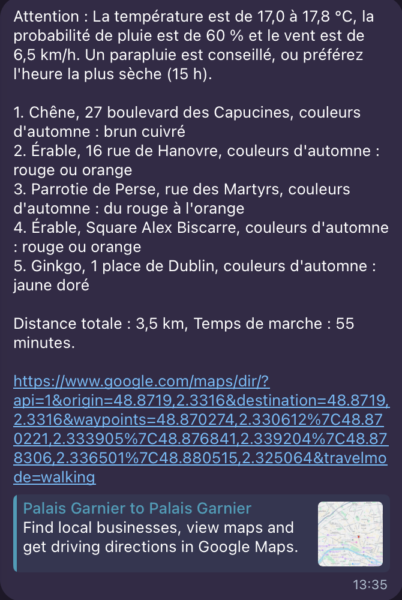
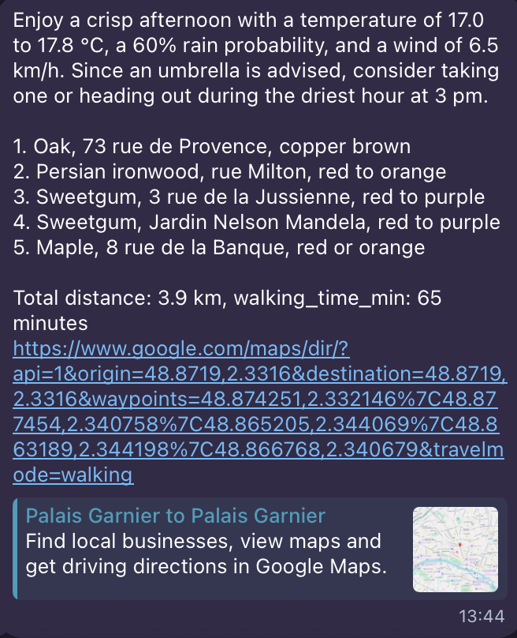
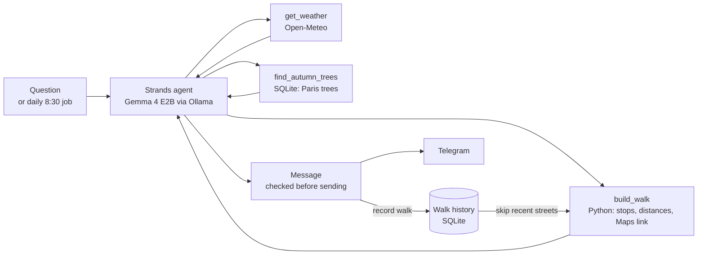

# autumn-walks

Ask "Where should I go for a walk this fall?" and get a short message, ready to send, inviting you on an autumn walk in Paris past trees with strong autumn colour (ginkgo, sweetgum, Persian ironwood, maple, oak). It runs on a small local model.

<p align="center">
  
  &nbsp;
  
</p>

**Design principle: the LLM writes, the code does the geography.**

## How it works



A [Strands Agents](https://strandsagents.com) agent running **Gemma 4 E2B** on [Ollama](https://ollama.com) uses three tools:

- `get_weather`: this afternoon's temperature, rain probability and wind from [Open-Meteo](https://open-meteo.com) (no API key), plus whether to take an umbrella and the driest hour
- `find_autumn_trees`: candidate trees within 2 km of the start, ginkgo and sweetgum first, one per street or park
- `build_walk`: picks 3 to 5 of them for a loop of at most 4 km in a straight line, and gives the trees, places, October colours, total distance, walking time and Google Maps link

Everything factual is computed in Python: distances, walking time (straight-line distance × 1.3 for real streets, at 4.8 km/h), number formatting, tree names and their October colours. The model only writes the message around those values. Before a message counts as ready, `plan_walk()` checks that it is built on a real `build_walk` result from the right start point, has the exact Maps link, mentions the wind and is under 150 words. If not, it tells the model why and asks again, up to twice.

**Walk history.** Every walk that is sent is saved in `data/history.sqlite`, which is not committed. The next walk skips the streets and parks of the last 2 walks, so three days in a row give three different routes.

## Run it

Needs [uv](https://docs.astral.sh/uv/) and [Ollama](https://ollama.com) running locally.

```bash
ollama pull gemma4:e2b
uv sync
uv run python try_walk.py "Where should I go for a walk this fall?" 2
```

`try_walk.py` asks the question the given number of times (default 3), as walks in a row with their own temporary history. It logs each tool call, retry reason, stop and latency, checks every message (including that no street repeats from the last 2 walks), and saves them to `walks/`.

### Daily message on Telegram

1. Create a bot with [BotFather](https://t.me/BotFather) and send it any message from your account.
2. Put the bot token in `.env` (it is gitignored): `TELEGRAM_BOT_TOKEN=...`
3. Save your chat id to `.env`: `uv run send-walk --find-chat`
4. Send a walk now: `uv run send-walk`

`send-walk` plans a walk, sends it only if it passed every check, and records it in the history. Options: `--lang fr|en` sets the language for this run (overrides `WALK_LANG`), and `--no-record` sends the walk without saving it to the history, which is handy for demos.

To send it every day at 8:30, create the launchd job from the template, then load it. If the Mac is asleep at 8:30, the walk is sent on wake, but not if the Mac was shut down. Ollama must be running.

```bash
sed -e "s|__PROJECT__|$PWD|g" -e "s|__UV__|$(which uv)|g" -e "s|__HOME__|$HOME|g" \
  launchd/local.autumn-walks.send-walk.plist.template \
  > ~/Library/LaunchAgents/local.autumn-walks.send-walk.plist
launchctl bootstrap gui/$(id -u) ~/Library/LaunchAgents/local.autumn-walks.send-walk.plist   # load
launchctl bootout gui/$(id -u)/local.autumn-walks.send-walk                                  # unload
```

Logs go to `~/Library/Logs/autumn-walks.log`.

### Settings

- `WALK_LANG=fr|en`: language of the message, French by default. For example, `WALK_LANG=en uv run python try_walk.py "Where should I go for a walk this fall?"`. The daily job asks the question in `DAILY_QUESTION` in `config.py`.
- Start point: coordinates in the question, such as "from 48.8795, 2.3090", are used as the start. Otherwise the walk starts from the default in `src/autumn_walks/config.py`, Opéra Garnier (48.8719, 2.3316). The same file holds the search radius, maximum loop length, walking speed and how many past walks to avoid.

## Data

The tree data comes from the Paris open data dataset ["Les arbres"](https://opendata.paris.fr/explore/dataset/les-arbres/) (Ville de Paris, [ODbL](https://opendatacommons.org/licenses/odbl/)). `data/trees.sqlite` holds 2,065 trees from 5 genera in the 1st, 2nd, 8th, 9th and 17th arrondissements, derived from it under the same licence. It keeps only trees a walker can reach (streets, public gardens and cemeteries, not school yards or sports grounds), with addresses rewritten into readable place names.

To rebuild the database, download the CSV export to `data/raw/` and run the loader:

```bash
curl -o data/raw/les-arbres.csv "https://opendata.paris.fr/api/explore/v2.1/catalog/datasets/les-arbres/exports/csv"
uv run python -m autumn_walks.load_trees
```

Weather data by [Open-Meteo](https://open-meteo.com) (CC BY 4.0).

## License

Code: [MIT](LICENSE). Tree data: ODbL, see above.
